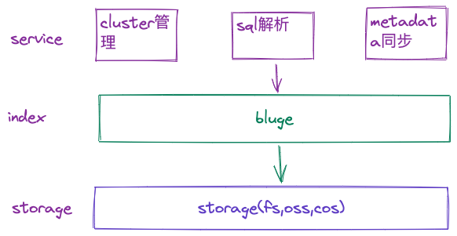

pole是一个云原生的分布式的全文搜索引擎，使用go编写，对外提供grpc、以及restful api。

pole的增删改查均使用sql语句进行操作。

pole索引内容可以保存在本地文件系统以及对象存储服务(oss,cos)，可以很方便的进行扩容。

## 架构

## Roadmap

- [x] sql 解析
- [x] metadata 存储
- [ ] grpc、restful api
- [ ] ui
- [ ] sharding支持
- [ ] 中文分词
- [ ] index 数据oss、cos存储
- [ ] cluster 模式支持、metadata同步以及分布式锁
- [ ] metrics
